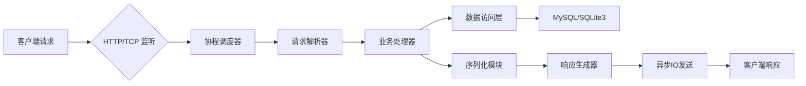

# 🚀 CXK - C++ 高性能服务器框架

**轻量级、高性能、模块化的 C++17 服务器开发框架**，专为高并发网络服务、微服务架构、实时通信系统等场景量身打造。

## 📌 项目状态


## 🌟 核心特性
| 功能模块         | 特性说明                                                                 |
|------------------|--------------------------------------------------------------------------|
| **多模式日志系统** 📝 | 支持文件日志、控制台日志、异步日志，内置日志分级（DEBUG/INFO/WARN/ERROR），满足多样化的日志记录需求。 |
| **动态配置管理** ⚙️  | 基于 YAML/JSON 的配置热加载，支持运行时动态更新配置，让配置调整无需重启服务。 |
| **协程与异步IO** 🧵 | 基于纤维（Fiber）的用户态协程，配合 Asio 实现高性能异步IO模型，显著提升系统并发处理能力。 |
| **定时器系统** ⏱️    | 高精度定时器（毫秒级），支持周期性任务与一次性任务，精准控制任务执行时间。 |
| **序列化模块** 📦   | 内置 Protobuf/JSON 序列化支持，可扩展自定义序列化协议，方便数据的传输与存储。 |
| **HTTP/WS 协议栈** 🌐 | 完整实现 HTTP/1.1 协议，支持 WebSocket 长连接，内置路由与中间件机制，轻松构建网络应用。 |
| **数据库连接池** 🔌  | 支持 MySQL/SQLite3 连接池，自动管理连接生命周期与故障重试，确保数据库操作的高效稳定。 |
| **高可用设计** 🏗️   | 内置进程守护（Daemon）、热重启、负载均衡与健康检查机制，保障服务的持续稳定运行。 |

## 📐 架构设计

该架构清晰展示了从客户端请求到响应的完整处理流程，各模块分工明确，协同工作，确保系统的高效运行。

## 🚦 快速开始

### 🔧 环境依赖
- **系统要求**：Linux/macOS（Windows 暂不支持）
- **工具链**：
    - CMake ≥ 3.15
    - GCC ≥ 9.0 / Clang ≥ 12.0
    - vcpkg（可选，用于管理第三方库）
- **依赖库**：
    - Boost ≥ 1.76（system/thread 模块）
    - OpenSSL ≥ 1.1.1
    - Protobuf ≥ 3.19
    - YAML-CPP ≥ 0.7
    - JSONCPP ≥ 1.9
    - Asio ≥ 1.14

### 📦 安装与编译
```bash
# 克隆项目
git clone https://github.com/cxk-team/cxk-framework.git
cd cxk-framework

# 使用 vcpkg 安装依赖（推荐）
# export VCPKG_ROOT=/path/to/vcpkg
# ./vcpkg install boost-system boost-thread openssl protobuf yaml-cpp jsoncpp asio

# 构建项目
mkdir build && cd build
cmake .. -DCMAKE_TOOLCHAIN_FILE=/path/to/vcpkg/scripts/buildsystems/vcpkg.cmake
make -j$(nproc)
```

### 🚀 第一个示例：HTTP 服务器
```cpp
// examples/http_server.cpp
#include "cxk/application.h"
#include "cxk/http/http_server.h"

using namespace cxk;

class MyServlet : public HttpServlet {
public:
    void handle(HttpRequest::ptr req, HttpResponse::ptr resp) override {
        resp->setBody("Hello, CXK Framework!\n");
        resp->setStatus(HttpStatus::OK);
        resp->setHeader("Content-Type", "text/plain");
    }
};

int main(int argc, char** argv) {
    Application app;
    app.init(argc, argv);
    
    auto server = std::make_shared<HttpServer>();
    server->addServlet("/", std::make_shared<MyServlet>());
    server->bind("0.0.0.0", 8080);
    
    app.addServer(server);
    return app.run();
}
```

编译运行：
```bash
make http_server
./bin/http_server -c configs/http.yaml
```

## 📚 模块文档

### 1. 日志系统
```cpp
#include "cxk/logger.h"

// 获取全局日志器
auto logger = LoggerManager::GetInstance()->getLogger("my_logger");

// 输出不同级别的日志
CXK_LOG_DEBUG(logger) << "Debug message";
CXK_LOG_INFO(logger) << "Info message";
CXK_LOG_ERROR(logger) << "Error message";
```
日志系统提供了便捷的日志记录方式，通过不同的日志级别，可以灵活控制日志的输出。

### 2. 协程编程
```cpp
#include "cxk/fiber.h"

void task() {
    // 协程内可直接调用异步函数
    Fiber::YieldToHold(); // 主动让出CPU
    // ... 异步操作后恢复执行
}

int main() {
    Fiber::ptr fiber = std::make_shared<Fiber>(task);
    fiber->swapIn(); // 启动协程
    return 0;
}
```
协程编程让异步操作变得更加简单，通过主动让出 CPU 资源，可以实现高效的并发处理。

### 3. 数据库操作
```cpp
#include "cxk/db/mysql.h"

void query_database() {
    auto pool = MySQLPool::Create(
        "localhost", 3306, "user", "password", "dbname", 10
    );
    auto conn = pool->getConnection();
    
    auto res = conn->query("SELECT * FROM users LIMIT 10");
    while (auto row = res->nextRow()) {
        // 处理查询结果
    }
}
```
数据库操作模块提供了连接池和查询功能，方便开发者进行数据库交互。

## 🤝 贡献指南
1. Fork 本仓库，创建 `feature/xxx` 分支。
2. 提交代码前确保代码格式规范（使用 `clang-format`）。
3. 新增功能需补充单元测试（位于 `test/` 目录）。
4. 提交 PR 时请注明关联 Issue。

我们欢迎广大开发者参与项目贡献，共同推动 CXK 框架的发展。

## 📮 联系方式
- 📧 邮箱：cxk-team@example.com
- 💬 交流群：[QQ群号] / [Telegram频道]
- 🌐 官网：https://cxk-framework.org

如果你在使用过程中遇到问题或有任何建议，欢迎通过以上方式与我们联系。

## 📜 开源协议
本项目采用 **MIT License**，允许商业使用、修改和再发布，但需保留原作者声明。

```
MIT License

Copyright (c) 2023 CXK Team

Permission is hereby granted, free of charge, to any person obtaining a copy
of this software and associated documentation files (the "Software"), to deal
in the Software without restriction, including without limitation the rights
to use, copy, modify, merge, publish, distribute, sublicense, and/or sell
copies of the Software, and to permit persons to whom the Software is
furnished to do so, subject to the following conditions:

The above copyright notice and this permission notice shall be included in all
copies or substantial portions of the Software.
```

---  
✨ **CXK 框架，让高性能服务器开发更简单！** ✨

[项目地址](https://github.com/Ben1524/cxkframework)